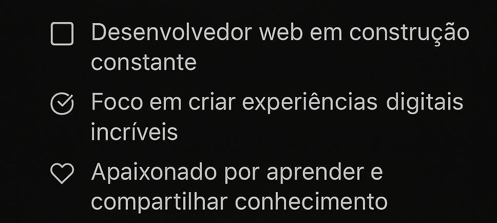

  

---

## 👋 Bem-vindo(a) ao universo do DomisDev!

💡 *Codificando ideias. Construindo futuro.*  
🎯 Desenvolvedor web em constante evolução  
🎨 Criativo, curioso e apaixonado por tecnologia

---

### 🚀 Tecnologias que estou explorando

  
  
  
  
  
  
  
  
  
  
  
  

---

### 🛠️ Ferramentas & Plataformas

  &nbsp;&nbsp;&nbsp;
  &nbsp;&nbsp;&nbsp;
  &nbsp;&nbsp;&nbsp;
  &nbsp;&nbsp;&nbsp;
  &nbsp;&nbsp;&nbsp;
  

---

### 📲 Me acompanha no LinkedIn:

  

